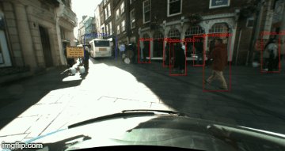

# Integrating Object Detection and Distance Ranging

This project uses the TensorFlow object detection API to create a system that takes two stereo images , detects objects in the scene and then estimates their distance from the cameras.

### Usage

- `git clone https://github.com/E-Renshaw/object-detection-distance-ranging.git`
- Inside main.py:
  - Change the `master_path_to_dataset` variable to point to your stereo dataset. I used the TTBB dataset from To The Bailey & Back (TTBB) dataset, however this is only available to Durham University students. There are [pleanty of others online](http://www.cvpapers.com/datasets.html) though, so you shouldn't have any problems finding something.
  - Change `camera_focal_length_px` and `stereo_camera_baseline_m` to match the settings of that camera that took your images
- Run `python main.py` from this directory

### Brief Implementation Details

There are 3 main parts: image pre-processing, object detection and distance ranging.

###### Image Pre-processing

Due to the extremely variable weather conditions of the north-east of England (and hence the images in the TBB dataset), the main goal here is to even out the light levels in the images. this is done by converting the image to HSV colourspace before applying contrast limited histogram equalisation to the V channel.

###### Object Detection

As explained above, detection was performed using the TensorFlow object detection API. Specifically, transfer learning was applied to Inception to detect cars and pedestrians in the left image from each stereo pair. Training was performed using the INRA and Stanford cars datasets.

I have included my model in frozen_inference_graph.pb.

###### Distance Ranging

Both images are converted to greyscale and then raised to the power of 0.75. A modified H. Hirschmuller algorithm (see openCV docs) is then applied to the images to calculate the disparity image. A speckle noise filter is then applied to complete the disparity image. Boundary replication is applied to the image in order to get complete scene coverage.

The median pixel is then extracted from each region identified as containing an object, before standard depth calculations are performed on them.

### Performance

The following table contains performance statistics from a random sample over 20 images in the TTBB dataset. Processing time was measured on a friend's system using a GTX 1060 (6GB) and i7-2600.

| True Positive | False Positive | False Negative | Average Processing Time per Image |
|:---:|:---:|:---:|:---:|
|51|0|13|0.8s|
